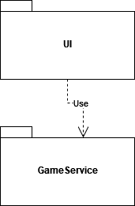
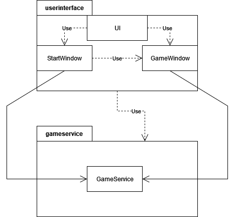
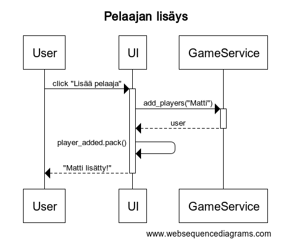
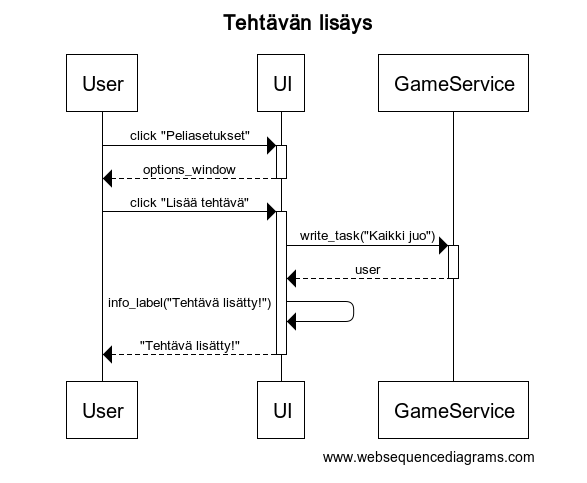
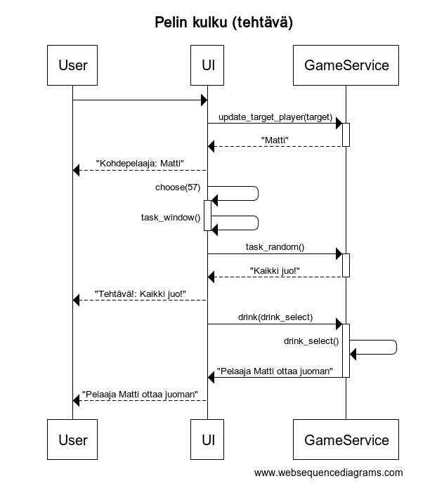

# Arkkitehtuurikuvaus

## Rakenne

Sovelluksen rakenne on suhteellisen yksinkertainen ja se noudattaa kaksitasoista kerrosarkkitehtuuria:

## Käyttöliittymä

Sovelluksessa on kaksi eri näkymää:

- Aloitusikkuna
- Peli-ikkuna

Kumpikin ikkuna on toteutettu omana luokkanaan. UI -luokka hallitsee, kumpi ikkunoista on näkyvissä. Sovelluslogiikkaa on pyritty eristämään käyttöliittymästä mahdollisimman paljon.

## Sovelluslogiikka

Sovelluksen pääasialliset toiminnallisuudet sisältyy 'GameService' -luokkaan. Luokka hakee tiedostosta pelin tehtävät ja kiroukset alustuksen aikana. Sovelluslogiikka injektoidaan sekä aloitus- että peli-ikkunan riippuvuudeksi. Luokassa on useita listoja, joita käytetään pelin aikana, kuten pelaajalista ja tehtävälista. Kumpaakin näistä käyttäjä voi muokata käyttöliittymän kautta. Pelaajien ja tehtävien lisääminen onnistuu luokan metodeilla:

- add_players(playername)
- write_task(task)

Kummassakin metodissa annetut argumentit lisätään listaan ja write_task -metodi lisää sen lisäksi sen pysyväksi riviksi tiedostoon. 

Sovelluksen pakkaus/luokkakaavio on jotakuinkin seuraava:

## Pysyväistallennus

Sovellus voi tallentaa ja poistaa tekstiä tiedostosta luokan 'GameService' avulla. Tekstiä tallennetaan yksinkertaisiin tekstitiedostoihin, joista sovellus sitten lukee rivit käynnistyksen yhteydessä.

### Tiedostot

Sovellus tallettaa tehtäviä ja kirouksia kahteen tekstitiedostoon.

Kansiossa nämä tiedostot ovat seuraavat:

'tasks.txt'

'curses.txt'

Tehtävät ja kiroukset luetaan yksinkertaisesti riveittäin, jotka tallennetaan pelin ajaksi omiin listoihin.

## Päätoiminnallisuudet

### Pelaajien lisääminen

Aloitusikkunassa käyttäjä voi lisätä pelaajia syöttämällä tekstikenttään haluamansa pelaajan nimen. Tämän jälkeen pelaajan voi lisätä painamalla "Lisää pelaaja" -nappulaa. Oheinen sekvenssikaavio kuvaa pelin logiikan etenemistä:

Nappula lähettää sovelluslogiikalle tekstikentän sisällön GameService -luokan metodille add_players("Tekstikentän sisältö"). Tämän jälkeen pelaajan nimi lisätään listalle ja käyttöliittymä näyttää käyttäjälle tekstin, että pelaaja on lisätty.

### Tehtävien/Kirousten lisääminen

Käyttäjä voi myös lisätä omia tehtäviään tai kirouksiaan peliasetuksista. Näiden lisääminen toimii lähes identtisesti pelaajan lisäyksen kanssa.

Ensin käyttäjä painaa peliasetusten nappulaa, joka avaa uuden ponnahdusikkunan tekstikenttineen. Tämän jälkeen kuin edellisessäkin metodissa, lähetetään tekstikentän sisältä GameService -oliolle, joka lisää sen sekä tiedostoon, että listaan. Käyttöliittymä jälleen kerran näyttää käyttäjälle tekstin, että tehtävä on lisätty.

### Pelin kulku

Alla oleva kuva näytää osan pelin kulusta ilman käyttäjän syötteitä. Toiminta alkaa siitä, kun pelin ajastin osuu aikaan 57:00.

Ensin käyttöliittymä päivittää kohdepelaajan kutsumalla metodia update_target_player(target), jossa parametrina toimii GameService -olion funtkio. Funktio palauttaa satunnaisesti listalta valitun pelaajan nimen ja käyttöliittymä näyttää sen käyttäjälle. Ajastin on osunut aikaan 57:00 ja se tarkistaa onko se aika, jolloin joko tehtävä tai kirous näytetään käyttäjälle. Käyttöliittymä avaa ponnahdusikkunan jonka tekstin parametrina on GameService -olion funktio task_random(). Tämä palauttaa satunnaisesti listalta valitun tehtävän String -muodossa, jonka käyttöliittymä jälleen näyttää käyttäjälle. Lopuksi sovellus valitsee, kuka tai ketkä pelaajista juovat sillä minuutilla. Kuten muissakin metodeissa, se palauttaa satunnaisesti valitun pelaajan seuraavaksi kohdepelaajaksi, jonka se taas piirtää käyttöliittymään. 
