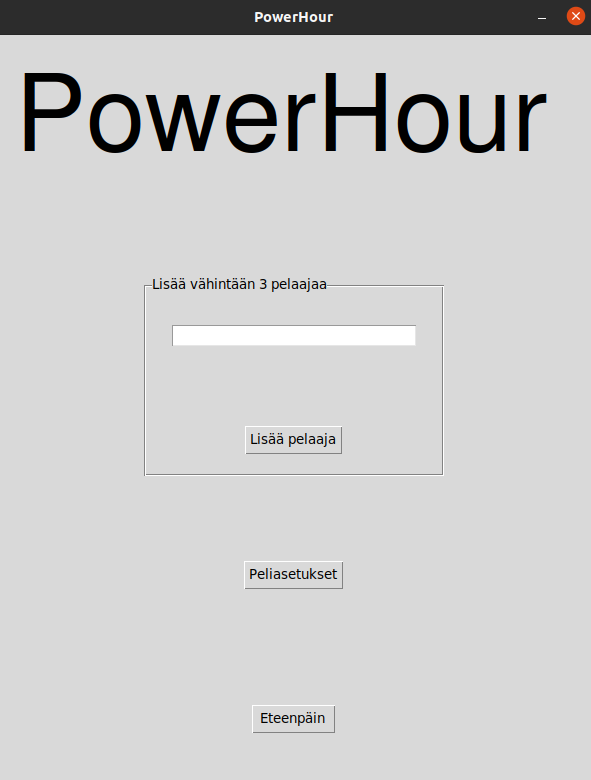

# Käyttöohje

## Asennus ja käynnistäminen

1. Ensimmäiseksi riippuvuudet tulee asentaa komentorivin komennolla:

        - poetry install

2. Tämän jälkeen suoritetaan alustustoimenpiteet komennolla:

        - poetry run invoke build

3. Nyt sovellus voidaan käynnistää komennolla:

        - poetry run invoke start

## Sovelluksen aloitusnakyma

Ensimmäiseksi peli käynnistää aloitusnäkymän:

Kuten sovelluksen näkymä kertookin, tulee käyttäjän lisätä vähintään 3 pelaajaa ennen pelin aloitusta (peliä ei voi aloittaa jos pelaajia ei ole tarpeeksi)

Käyttäjä voi kirjoittaa pelaajan nimen kirjoituskenttään ja sen jälkeen klikata nappulaa "Lisää pelaaja".

Peliasetuksista käyttäjä voi lisätä omia tehtäviä/kirouksia, sekä säätää pelataanko normaalia 60 minuutin, vai lyhennettyä 30 minuutin peliä

Tämän jälkeen peliin voi siirtyä painamalla "Eteenpäin" -nappulaa.

## Sovelluksen pelinäkymä

Käyttäjä voi nyt käynnistää pelin painamalla "Aloita" -nappulaa, jolloin pelin ajastin lähtee käyntiin ja peli alkaa.
