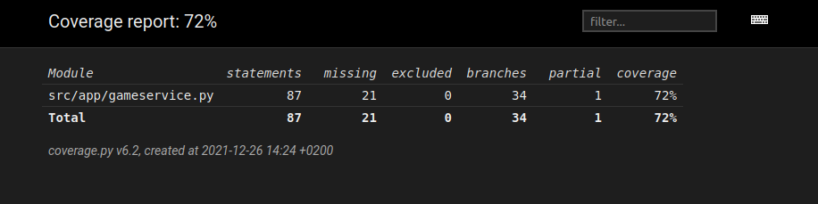

# Testausdokumentti

Ohjelmaa on testattu enimmäkseen automatisoiduilla unittest -testauksilla.

## Yksikkö- ja integraatiotestaus

### Sovelluslogiikka

Sovelluksen logiikasta vastaa 'GameService' -luokka, jota testataan 'TestService' -luokalla.

### Testauskattavuus 

Haarautumakattavuudesta on jätetty pois käyttöliittymän osat. Lopullinen kattavuus on 72%

Testeistä ulos jäivät satunnaisuuteen turvautuvat funktiot, sekä pari funktiota, joiden toiminnallisuus oli identtistä toisen testatun funktion kanssa.

### Toiminnallisuudet

Sovellusta on manuaalisesti testattu yrittämällä syöttää virheellisiä (esim tyhjiä) tekstejä pelaajien- ja tehtävien lisäykseen.
Ajastimen pysäyttäminen erilaisilla tavoilla on myös testattu. Esimerkiksi peli pysähtyy jos käyttäjä vaihtaa ikkunaa pelin sisällä.

### Sovellukseen jääneet laatuongelmat

Jos käyttäjä painaa liian nopeasti "Aloita" -nappulaa, sovellus saattaa laittaa kaksi ajastinta päälle samanaikaisesti, jolloin sekunnit kuluvat tavanomaista nopeammin. 
